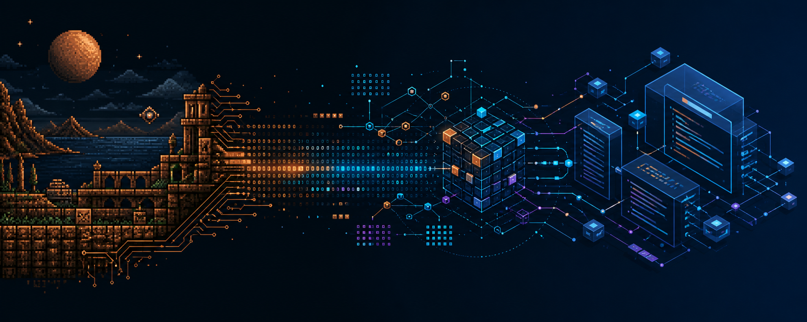

<div align="center">

# Amiga2JS

### Evidence-driven reconstruction of legacy games

Turn Amiga/m68k binaries into maintainable TypeScript through static analysis,
runtime evidence, semantic reconstruction, and deterministic verification.



**Experimental · Phase 0 · Not ready for production use**

</div>

## Quick start

Requirements: **Node.js 22+** and **npm 10+**.

```sh
git clone https://github.com/maciejtatol/Amiga2JS.git
cd Amiga2JS
npm install
```

Run the compatibility doctor against the included Phase 0 manifest:

```sh
npm run doctor --workspace @retroport/cli -- \
  --manifest fixtures/amiga-m68k-horizontal/project.example.json \
  --rules compatibility/amiga
```

Expected output:

```text
SUPPORTED
```

Run all checks:

```sh
npm run typecheck
npm test
```

## What is Amiga2JS?

Amiga2JS is an evidence-driven reverse-engineering project, not a
binary-to-JavaScript transpiler. Its RetroPort framework collects static and
runtime evidence, forms falsifiable semantic hypotheses, verifies them
independently, and only then generates modern source.

```text
legacy binary
    → static + runtime evidence
    → semantic reconstruction
    → independent verification
    → deterministic TypeScript
```

The initial source platform is **Commodore Amiga / Motorola 68000**. The first
target is a rendering-independent TypeScript simulation; browser and Phaser
adapters come later.

## Why evidence-driven?

- Every automatic conclusion points back to persisted evidence.
- AI hypotheses are never treated as ground truth.
- The emulator remains the runtime oracle.
- Verification compares behavior tick by tick and reports the first divergence.
- Partial, manual, and unsupported are valid outcomes—there is no fake success.
- Reconstructed physics, collision, and timing are not silently replaced with
  framework defaults.

## Current scope

Amiga2JS is in **Phase 0**. The current implementation includes foundational
runtime-validated schemas, a YAML compatibility registry, and the
`retroport doctor` diagnostic path.

The first vertical slice will reconstruct a tiny stripped Amiga HUNK fixture
owned by this repository. Ghidra, Amiberry, Phaser, model-provider integration,
and Superfrog reconstruction are intentionally not part of the current
milestone.

## Repository layout

```text
apps/
  cli/                         RetroPort command-line application
packages/
  core/                        Provider-neutral orchestration
  schemas/                     Runtime-validated contracts
  evidence/                    Evidence persistence and queries
  compatibility/               Rules and capability diagnostics
compatibility/
  amiga/                       Community-extensible Amiga rules
fixtures/
  amiga-m68k-horizontal/       Deterministic Phase 0 fixture
docs/                          Architecture and project documentation
```

## Roadmap

1. Finish foundational contracts and compatibility diagnostics.
2. Build the repository-owned stripped HUNK fixture.
3. Export deterministic static evidence with headless Ghidra.
4. Capture deterministic runtime observations with Amiberry.
5. Reconstruct and independently verify horizontal movement.
6. Generate TypeScript and compare state tick by tick.

Superfrog is a later real-world reference target, not the Phase 0 input.

## Contributing

The project is early, so small, testable changes are preferred. Before opening
a pull request, run:

```sh
npm run typecheck
npm test
```

Compatibility knowledge should be contributed as validated rules rather than
hard-coded special cases.

## License

License terms have not been selected yet. Until a license file is added, do not
assume the repository grants redistribution rights.
