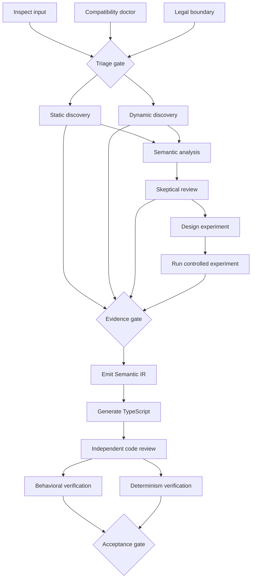

# Core engine workflow

The first core-engine slice is a deterministic, provider-neutral DAG runner.
Workflow structure is data; Ghidra, Amiberry, model providers, persistence, and
target generators are injected later as step handlers.

Independent nodes in the same layer run concurrently. Joins wait for all of
their prerequisites. A failed or blocked step prevents every dependent step
from running, while unrelated branches may still complete. Step IDs are sorted
within each layer, producing a stable execution record independent of definition
order. Each handler receives an immutable context snapshot and the validated
results of its direct dependencies, so dataflow never relies on shared mutation.

## Implementation sequence

1. Deterministic graph validation and execution.
2. Evidence lifecycle and generation gates as pure functions.
3. Reviewer-input isolation projections.
4. In-memory repositories and resumable workflow snapshots.
5. Content-addressed artifacts and SQLite persistence.
6. HUNK, Ghidra, and Amiberry adapters.

The engine deliberately does not contain provider-specific APIs. Concrete
adapters compose with the graph at the CLI boundary.
