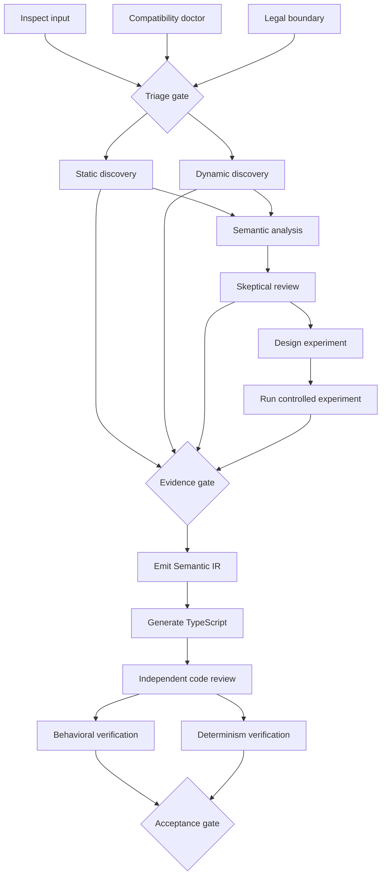

# Core engine workflow

The first core-engine slice is a deterministic, provider-neutral DAG runner.
Workflow structure is data; Ghidra, Amiberry, model providers, persistence, and
target generators are injected later as step handlers.

Independent nodes in the same layer run concurrently. Joins wait for all of
their prerequisites. A failed or blocked step prevents every dependent step
from running, while unrelated branches may still complete. Step IDs are sorted
within each layer, producing a stable execution record independent of definition
order. Each handler receives an immutable context snapshot and the validated
results of its direct dependencies, so dataflow never relies on shared mutation.

Every step declares a Zod schema for its output. The engine validates the full
agent-result envelope and payload before making it available downstream. Context,
results, and projected dependency inputs must be JSON-safe so future persistence
cannot silently change their meaning.

The skeptical-review edge uses a dedicated projection. It exposes the claim,
evidence IDs, addresses, trace IDs, and reproducible experiments while removing
the analyst's private narrative before the reviewer handler is invoked.

## Implementation sequence

1. Deterministic graph validation and execution.
2. Evidence lifecycle and generation gates as pure functions.

## Resumable execution

Persisted workflows declare an explicit workflow revision and are checkpointed at
stable DAG-layer boundaries. The initial snapshot is written before any handler
runs; each completed layer atomically commits its snapshot and ordered audit
events. Resume validates the workflow identity, revision, topology, and stored
step outputs, then skips committed layers. Stored context is authoritative.

Handlers receive a stable idempotency key (`runId:workflowRevision:stepId`). A
crash before a layer checkpoint can rerun that entire layer, so integrations must
use that key for idempotency; execution is deliberately not advertised as
exactly-once. The current in-memory repository is a port-validation baseline,
not durable production storage.

Evidence has a separate immutable-by-ID repository port. Identical writes are
idempotent, conflicting writes are rejected, references may arrive out of order,
and detached snapshots are deterministically sorted. Lifecycle evaluation remains
a separate policy layer.
3. Reviewer-input isolation projections.
4. In-memory repositories and resumable workflow snapshots.
5. Content-addressed artifacts and SQLite persistence. The `@retroport/persistence`
   package uses Node 22.13+'s built-in `node:sqlite` API, so it has no native npm
   dependency. SQLite snapshots and audit events are committed atomically; artifact
   IDs are SHA-256 digests. This phase does not claim exactly-once execution.
6. The `@retroport/source-amiga-hunk` package builds the repository-owned
   `amiga-m68k-horizontal` micro-fixture and strips metadata deterministically.
7. The `@retroport/static-analysis` package defines the validated Ghidra
   snapshot boundary; Ghidra execution remains an optional external adapter.
8. Amiberry runtime adapter.

The `@retroport/runtime-amiberry` package defines validated input and
observation records, an injectable Amiberry transport, and a deterministic
scenario-capture helper. It does not require an Amiberry installation in CI.

The engine deliberately does not contain provider-specific APIs. Concrete
adapters compose with the graph at the CLI boundary.
